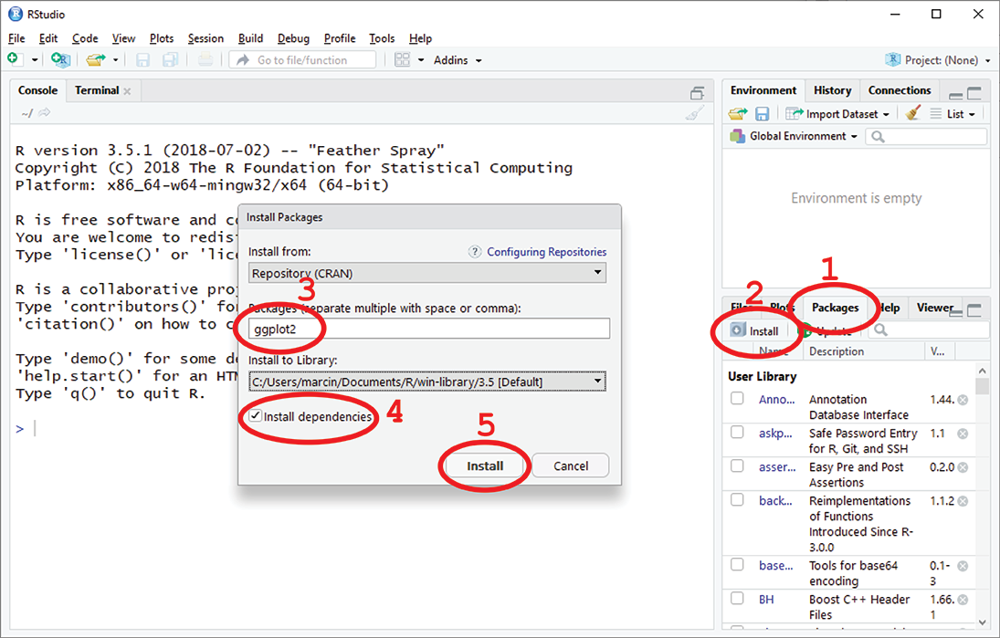

---
<style type="text/css">
.column {
  float: left;
}
.left {
}
.right {
  width: 150px;
  float: right;
}
.row:after {
  content: "";
  display: table;
  clear: both;
}

.table{
  width: 60%;
  margin-left: 20%; 
  margin-right: 20%;
}
.table th{
  text-align: left;
  background: lightgrey;
}

tbody th{
  padding: 5px;
  text-align: center;
  background: lightgrey;
  color: black
}
tbody td{
  padding: 5px;
  text-align: left;
  background: white;
  color: black
}

blockquote:before{
  display: block;
  position:relative;
  left: -0.55em;
  top: -0.3em;
  height: 0px;
  content: "!";
  font-size: 2em;
  color: #a00;
}
blockquote{
  border-bottom: 1px solid #ccc;
  border-left: 10px solid #ccc;
  border-radius: 5px;
  padding: 0.5em 0.5em;
  font-size: 1em;
}
ul{
  padding-left:1.25em;
}
ol{
  padding-left:1.25em;
}
#TOC:before{
  font-size: 1.5em;
  padding-left: 0.25em;
  content: "Contents";
}
#TOC{
  border: 2px solid #b0d0d0;
  padding: 1em 0.25em;
  border-radius: 5px
}

.footer{
  text-align: center;
  font-size: 150%;
}
.footer img{
  height: 1em;
}
.slides{
  color: darkred;
  background: #e8f8f8;
  padding: 0.4em 1em;
  border: 2px solid #b0d0d0;
  border-radius: 5px
}
</style>

<div style="border: 2px solid #b0d0d0; background-color: #e8f8f8; padding: 1em 0.25em; border-radius: 5px">
This document was created in R Markdown (http://rmarkdown.rstudio.com, http://rmarkdown.rstudio.com/articles_intro.html). R Markdown documents can be easily created in RStudio.</div>

# Learning Objectives for Day 2

* Morning Session:
    * Writing functions
    * Using loops
    * Reading and writing data files
    * Merging data frames
    * Sub-setting data frames
    * Adding rows to data frame
* Afternoon Session:
    * R Packages
    * Making plots and histograms with ggplot2
    * Reshaping data frames with tidyr
    * Re-ordering levels of a factor
    * Data wrangling with `apply` function
    * Searching and replacing text 

# R functions used today
<div style="border: 2px solid #b0d0d0; background-color: #e8f8f8; padding: 1em 0px; border-radius: 5px">
* `#` - Starts comment
* `help` - alternatively `?' returns help on specified topic
* `read.table` - Reads a file in table format and creates a data frame from it
* `write.table` - writes data frame as a file in table format
* `class` - returns name of the _class_ of the object
* `str` - Display the structure of R object
* `class` - Display _class_ of the object
* `sample` - Random sample from a vector
* `head` - Returns first part of an object, e.g. first rows of a data frame
* `tail` - Returns last part of an object, e.g. last rows of a data frame
* `mean` - Calculates arythmentc mean
* `sd` -  Calculates standard deviation
* `nrow` - number of rows in data frame or matrix
* `ncolumns` - number of columns in data frame or matrix
* `summary` - Returns summaries of the results of various model fitting functions, e.g. mean, meadian, min, max
* `$` - Dolar operator, extracts or replaces parts of an object
* `[]` - Square brackets or index operator, extracts or replaces parts of an object
* `&` - Logical operator _and_
* `|` - Logical operator _or_
* `%in%` - Logical operator _present in_
* `factor` - Create a factor
* `levels` - Returns levels of a factor variable
* `library` - Loads a package (e.g. `ggplot2`)
* `for` - for loop
* `while` - while loop
* `if` - `else` - conditional statement
* `length` - number of elements in an object, e.g. length of a vector
* `print` - Prints its argument
* `paste` - Concatenate vectors after converting to character
* `rbind` - add rows to data frame or matrix
* `merge` - merge two data frames
* `exists` - checks if an object was defined
* `ggplot` - Create a new plot with ggplot
* `aes` - ggplot aesthetic mapping
* `geom_point` - ggplot scatterplot
* `geom_boxplot` - ggplot box-plot
* `geom_jitter` - ggplot adds a small amount of random variation to the location of each point
* `geom_violin` - ggplot violin plot
* `geom_histogram` - ggplot histogram
* `geom_density` - ggplot density plot
* `ggtitle` - ggplot - plot title
* `geom_smooth` - ggplot data smoothening
* `facet_wrap` - ggplot panels
* `xlab`, `ylab` - ggplot axes labels
* `gather` - tidyr - _reshape_ data frame from _wide_ to _long_ format
* `scatter` - tidyr - _reshape_ data frame from _long_ to _wide_ format
* `apply` - apply function to data
</div>

------------------

## Remember to comment your code!
```{r, echo=T}
######################################################################
#                                                                    #
#   ***     Introduction to R and RStudio, Programming in R     ***  #
#                                                                    #
#   workshop on 17 - 18 February 2020                                #
#                                                                    #
#                                                                    #
#                                            marcin.adamski@anu.edu.au
######################################################################
```


# Programming and Functions

<br>
<span class="slides">slides 56-57</span>

## Exercise 1: Unit conversion
We are getting a lot of data from USA. All volumes are given in fluid ounces. We need to create a function for converting fluid ounces into milliliters.  
Task: Create function `oz2ml()` to convert fluid ounces into milliliters.

```{r}
################################################################################
#
oz2ml <- function(v)
{
  c = 29.5735 #conversion constant
  v * c
}#oz2ml
```

Outputs from function `oz2ml`:
```{r}
oz2ml(1)
oz2ml(0.5)
oz2ml(c(0.5, 0.7, 1)) #please note use of vectorisation
```
<br>

<span class="slides">slides 58-63</span>


## Exercise 2: Iteration with `for` loop

Write a function called `fact` to calculate a factorial of non-negative integer number _n_.
$$
n! = n\times (n - 1)\times ... \times 3\times 2\times 1
$$
```{r}
fact <- function(n)
{
  f <- 1        #calculated factorial, starting value is 1 as 1! = 1

  #loop performing the factorial multiplication
  for(v in 1:n)
    f <- f * v
  f
}
```

Example outputs from function `fact` for several arguments:

```{r}
fact(1)
fact(5)
fact(0)
```


# Working with data: The Orb-Spider Example
Today our data comes from an ecology project focused on Orb-Weaver spider. (Orb-Weaver spider is a _star_ in any decent R workshop. ;) )

<center>

</center>
<br>
<span style="font-size:150%">Scenario:</span> We are part of a team studding Ecology of Golden Orb-Weaver spiders (_Nephila edulis_). The research objective is to compare spider populations living in different climate zones in Australia:  

- Cool-Temperature Inland - Canberra, ACT
- Mid-Temperature Coastal - Jervis Bay, ACT
- Alpine - Cooma, NSW  

The plan is to compare body weight of the spider with the diameter of the web the spider weaves and asses two hypothesis:  

1. Bigger and heavier spiders make larger webs.
2. The climate where spiders live affects weight of the spiders and the size of their webs.

Our colleagues have already went to the wild and sampled 100 spiders at each location. The web diameters were measured in the field and recorded in the "spider_web.tsv" file. The spiders were caught and sent to the laboratory for weight assessment. Thus the spiders' weight was recorded in a separate file "spider_weight.tsv".

Each sample (spider data) includes following information in the "spider_web.tsv" file:  

- spider_id - identifier of the spider (sp_1, sp_2, sp_3...),
- population - location where the spider was assesd (canberra, cooma, jervis),
- web_dia - diameter of the web the spider weaved (numerical values),

and, in a separate file "spider_weight.tsv":

- spider_id - identifier of the spider (sp_1, sp_2, sp_3...),
- weight - weight of the spider (numerical values).

We are **The Quantitative Researcher** in the team - this is our task to process and analyze the data:  

- Present the data in graphical format on series of explanatory plots and graphs.
- Perform statistical test to prove that the climate indeed affects the size of the web.
- When performing our research we must adhere the most important rule of science - **The Reproducibility**. We will create a workflow, a program in R which can be re-run to reproduce our findings.
<br>
  
## Excercise 1: Get the data

1. Download following data files and save them in your project's directory.  
  'spider_web.tsv' http://leucon.anu.edu.au/marcin/r_data/spider_web.tsv  
  'spider_weight.tsv' http://leucon.anu.edu.au/marcin/r_data/spider_weight.tsv  
2. Load data from file "spider_web.tsv" into data frame named `spider.web` and data from file "spider_weight.tsv" into data frame `spider.weight`.  

Ensure that you checked:  

* what is the column separator character
* does the file has a header

```{r, echo=T}
# load the two data files into data frames
spider.web    <- read.table("spider_web.tsv",    sep = "\t", header = TRUE)
spider.weight <- read.table("spider_weight.tsv", sep = "\t", header = TRUE)
```

> It is also possible to use the *Import Dataset* feature from the **Environment** panel in RStudio.

## Excercise 2: Quick data exploration:

* Check that the variables `spider.web` and `spider.weight` are indeed `data.frame` with function `class(spider.web)` and `class(spider.weight)`.
* See structure of the data frames with `str` function.
* Print 5 first rows of the data with the `head` function.
* Get basic statistics of the data with the `summary` function.
* Print number of rows in each data frame with the `nrow` function.  
    
Checking that `spider.web` and `spider.weight` are `data.frame` objects  \

`spider.web`:
```{r, echo=T}
print(paste("spider.web is", class(spider.web)))
```

`spider.weight`:
```{r, echo=T}
print(paste("spider.weight is", class(spider.weight)))
```

Revealing their internal structure
```{r, echo=T}
print("spider.web structure:")
str(spider.web)

print("spider.weight structure:")
str(spider.weight)
```

Printing out a few first rows
```{r, echo=T}
print("spider.web:")
head(spider.web, n = 5)

print("spider.weight:")
head(spider.weight, n = 5)

```

> Question: Which column(s) uniquly identifie(s) each observation (the row)? 

Basic statistics:
```{r, echo=T}
print("spider.web:")
summary(spider.web)

print("spider.weight:")
summary(spider.weight)

```

Number of rows:
```{r, echo=T}
print("spider.web:")
nrow(spider.web)

print("spider.weight:")
nrow(spider.weight)

```
<br>

<span class="slides">slides 64-69</span>

## Excercise 3: Combine both data frames into one assuring consistency of the data.

Create a new data frame called `spider` combing data from `spider.web` and `spider.weight`.
<br>
`spider` should have following format:
<table align="center" border="1" cellpadding="50">
<tr>
  <th>population</th><th>spider</th><th>web_dia</th><th>weight</th>
</tr>
<tr>
  <td>canbera</td><td>sp_1</td><td style="text-align:right">102.2</td><td style="text-align:right">11.8</td>
</tr>
<tr>
  <td>cooma</td><td>sp_2</td><td style="text-align:right">80.3</td><td style="text-align:right">4.4</td>
</tr>
<tr>
  <td>...</td><td>...</td><td style="text-align:right">...</td><td style="text-align:right">...</td>
</tr>
<tr>
  <td>jervis</td><td>sp_300</td><td style="text-align:right">34.2</td><td style="text-align:right">2.5</td>
</tr>
</table>
<br>

> Which function are we going to use: `rbind`, `cbind` or `merge`?

Before we start, there is something that needs our attention:  
As we have just shown above `spider.weight` is a few rows shorter that `spider.web`. We expected them to be the same 300 rows (3 populations, 100 samples each). Before we merge the data we need to investigate...  
<br>
The question is: Which rows from `spider.web` are missing in `spider.weight`?  
We work on the problem is steps:

1. Which rows in `spider.web` are PRESENT in `spider.weight`? Use the `%in%` operator, not the `==` and explain why.
```{r, echo=T}
head(spider.web$spider %in% spider.weight$spider)
```

2. Now, reverse the question above: Which rows in `spider.web` are **NOT** PRESENT in `spider.weight`?
```{r, echo=T}
head(!(spider.web$spider %in% spider.weight$spider))
```

3. To reveal the rows missing in `spider.weight` we can now use the logical vector we just made to index the data frame `spider.web` (indexing with logical value).
```{r, echo=T}
spider.web[!(spider.web$spider %in% spider.weight$spider), ]
```

There are several spiders with _data missing_ in `spider.weight`. After investigation we concluded that the missing spiders simply escaped during transfer to the lab (the car driver had spider bitemarks on her ankles).  
As our analyses will require complete cases we will drop the incomplete records during the data merging.


Before we merge the data we need to answer following questions:

* What type of merge (left, right, inner, outer) do we need to perform to get only the complete cases (spiders present in both data frames)?
* Which column(s) do we use for the merge as the 'key' column(s)?

Now, when we know answers to the questions above, we are ready to create a new `data.frame` called `spider` from merged `spider.web` and `spider.weight`.

```{r, echo=T}
spider <- merge(spider.web, spider.weight, by = "spider", all.x = FALSE, all.y = FALSE)
str(spider)
```

For future use we will write data from `spider` into a text file 'spider.csv'.  

Parameters of the text file are:

* separator: ',' (coma)
* include names of the columns
* do not include names of the rows
* do not quote the fields in the file

```{r, echo=T}
write.table(spider, "spider.csv", quote = FALSE, sep = ",", row.names = FALSE, col.names = TRUE)
```

## Exercise 4: Calculate basic statistics:

Calculate mean and standard deviation for columns `web_dia` and `weight`.

```{r, echo=T}
print("mean and sd from web_dia")
mean(spider$web_dia)
sd(spider$web_dia)

print("mean and sd from weight")
mean(spider$weight)
sd(spider$weight)
```

Now, perform the same calculations as above, but using data from only the Canberra population. Use the indexing 'by logical expression'.

```{r, echo=T}
print("mean and sd from web_dia for canberra")
mean(spider[spider$population == "canberra", "web_dia"]) 
sd(spider[spider$population == "canberra", "web_dia"])

print("mean and sd from weight for canberra")
mean(spider[spider$population == "canberra", "weight"])
sd(spider[spider$population == "canberra", "weight"])
```

## Exercise 5: Identify outliers in each population.

We want to create a new data frame called `spider.outlier` which will contain data for spiders too heavy or too light when compared to mean spider weigh from that population. We want to get the spiders with weight farther than ?2 standard deviation from the mean.  

As it is a relatively complex problem let's approach it in steps:  

1. Define variable `population` and assign it with value 'canberra'.
2. Calculate mean weight of spiders from `population` and assign it to variable `weight.mean`.
3. Calculate std. deviation of spiders from `population` and assign it to variable `weight.sd`.
4. Create a logical vector `outspider` having `TRUE` only for spiders from `population` **AND** with weight less than `weight.mean` - 2 * `weight.sd` **OR** weight more than `weight.mean` + 2 * `weight.sd`.
5. Use `outspider` vector to subset data frame `spider` and assign resulting data frame to variable `outlier`.
6. Do steps 1 to 5 in `for` loop repeating for each population. 
    * You will need to modify step 1 from simple variable assignment to `for` loop.
    * You will need to modify step 5 to cleverly add (bind) rows from all the poulations to `outlier
    
```{r, echo=T}
# step 1
population <- "canberra"

#step 2
weight.mean <- mean(spider[spider$population == population, "weight"])

#step 3
weight.sd <- sd(spider[spider$population == population, "weight"])

#step 4
outspider <- spider$population == population & (
             spider$weight < weight.mean - 2 * weight.sd | spider$weight > weight.mean + 2 * weight.sd
             )

#step 5
outlier <- spider[outspider, ]

#step 6
outlier <- spider[FALSE, ] #create empty data frame of the same structure as spider
for(population in levels(spider$population)){
  weight.mean <- mean(spider[spider$population == population, "weight"])
  weight.sd   <- sd(spider[spider$population == population, "weight"])
  outspider    <- spider$population == population & (
                  spider$weight < weight.mean - 2 * weight.sd | spider$weight > weight.mean + 2 * weight.sd
                  )
  outlier <- rbind(outlier, spider[outspider, ])
}  

write.table(outlier, "outlier.tsv", quote = FALSE, sep = "\t", row.names = FALSE, col.names = TRUE)
```
<br>

<span class="slides">slides 70-76</span>

## Exercise 6: Explore and plot data with ggplot2 package

The ggplot2 is a package, an extension to R. Before we start using it, we need to load the ggplot2 library. If we had not used ggplot2 ever before we need to install it first. We can use the `install.packages("ggplot2")` funtion or use the **Install** option from the **Packages** panel. In RStudio I suggest using the **Install** option and following the displayed dialog. Simply, follow the steps on the figure below:  


> Quick reference to ggplot2: http://ggplot2.tidyverse.org/reference

Once we have the ggplot2 installed we can finally load it with function:

```{r, echo=T, warning=FALSE, message=FALSE}
library(ggplot2)
```

Our first task is to plot the web diameter vs. spider's weight (in other words: plot the web diameter as a function of spider's weight).

First, we create the ggplot object using the `ggplot` function:

```{r, echo=T}
ggplot()
```

The statement above created an empty _container_ object for the plot. Usually it is used to specify _components_ common to all the layers of the graph. They are passed to `ggplot` as arguments. The common components are e.g. the data and coordinates passed as `aes` object created with the `aes` function.:

The data to use (ggplot uses `data.frame` as it's source of data).
```{r, echo=T}
ggplot(data = spider)
```

The mapping aesthetic (what will be plotted on x and y axes):
```{r, echo=T}
ggplot(data = spider, mapping = aes(x = weight, y = web_dia))
```

We may assigh the ggplot object (result of the `ggplot` function) to variable `g`, so we can leter easily _add_ extra layers showing the actual data.
```{r, echo=T}
g <- ggplot(data = spider, mapping = aes(x = weight, y = web_dia))
```

Now, we have our _base_ ready and all what is left to do is to plot the data. This step is done with the _geometry_ leyer(s). These layer(s) (there more be one or more) specify the form in which the data will be presented. The geometry components (among other components) are added to the ggplot object with the `+` operator.


### Scatter plots

To create an X-Y or a scatter plot, we use the geometry `geom_point`.  
To ensure that the plot will appear in any situation we **should** explicitly print it with the `print()` function rather than rely on R ability to correctly direct the output.

```{r, echo=T}
print(g + geom_point())
```

> In the following  examples we will ommit the `print()` function for simplicity.

On the plot above we got all the data point from all three populations plotted in the same color. What if we wanted to see the populations color-separated?  
To achieve this we will use the the 'group by colour' functionality by adding argument `colour` (or `color`) to the `aes` function: `colour = population`. Assigning `population` to the `colour` argument tells ggplot to color the plot's points with color depending on the value of the `population` column.  
We can either add the `colour` to the `aes` already passed to the `ggplot` or add a new `aes` with only the `colour = population` argument to the `geom_point` function.  
Do you know what is the difference between adding `colour = population` to the `aes` in `ggplot` vs. in `geom_point`?

```{r, echo=T}
g + geom_point(aes(colour = population))
```

Now lets fit a linear model (a line) to the data points with the `geom_smooth(method = 'lm')` function. The `lm` is the 'linear model'. 
```{r, echo=T}
g + geom_point(aes(colour = population)) + geom_smooth(method = 'lm')
```

Please refer to the R manual to learn how to fit other functions to the data, e.g. Local Polynomial Regression `loess`.
```{r, echo=T}
g + geom_point(aes(colour = population)) + geom_smooth(method = 'loess')
```

We can fit the line to the data points separately for each population:
```{r, echo=T}
g + geom_point(aes(colour = population)) + geom_smooth(method = 'lm', aes(colour = population))
```

For a better visibility we can create a separate _facet_ for each population adding a new _layer_ with the `facet_wrap(~ population)` function:
```{r, echo=T}
g + geom_point(aes(colour = population)) + geom_smooth(method = 'lm', aes(colour = population)) + facet_wrap(~ population)
```

### Box plots

A box plot is a standardized way of displaying the distribution of data.

From the http://ggplot2.tidyverse.org/reference/geom_boxplot.html manual:  
'The lower and upper hinges correspond to the first and third quartiles (the 25th and 75th percentiles). The upper whisker extends from the hinge to the largest value no further than 1.5 \* IQR from the hinge (where IQR is the inter-quartile range, or distance between the first and third quartiles). The lower whisker extends from the hinge to the smallest value at most 1.5 \* IQR of the hinge. Data beyond the end of the whiskers are called "outlying" points and are plotted individually.'  
  

A box plot showing the web diameter in different spider populations may look like this:
```{r, echo = T}
ggplot(
  data = spider, mapping = aes(x = population, y = web_dia, colour = population)) + 
    geom_boxplot() + 
    geom_jitter(width = 0.2) +
    xlab("Spider Population") + 
    ylab("Web Diameter, cm") +
    scale_x_discrete(breaks = c("canberra", "cooma", "jervis"), labels = c("Canberra, ACT", "Cooma, NSW", "Jervis Bay, ACT")) +
    ggtitle("Diameter of Webs made by Orb-Weaver Spiders from:\nCanberra ACT, Cooma NSW, and Jervis Bay ACT", subtitle = "data collected in year 2019") + 
    theme_minimal() + 
    theme(legend.position="none", panel.grid.major.x = element_blank())
```

The code looks a bit intimidating… We will create this graph in steps:
Start from creation of the ggplot object.

* What is the data?

And the `aes` function inside of the `ggplot`

* What is on x axis?
* What is on y axis?
* What is the grouping factor (the colour)?

```{r, echo=T}
g <- ggplot(data = spider, mapping = aes(x = population, y = web_dia, colour = population))
```

Now, having the canvas ready we can add the box plot geometry.

```{r, echo=T}
g + geom_boxplot()
```

As you can see we are still missing a few element, called layers on the plot:

* The data points can be added with `geom_point` or as in this case with `geom_jitter`.
* The x and y axes labels with `xlab` and `xlab`.
* The title with `ggtitle`.

Advanced options:

* The x-axis tick labels were added with `scale_x_discrete`.
* The over-all look of the graph was changed with `theme_minimal()`.
* The legend was hidden with `theme(legend.position="none")`.

```{r, echo=T}
print(ggplot(
  data = spider, mapping = aes(x = population, y = web_dia, colour = population)) + 
    geom_boxplot() + 
    geom_jitter(width = 0.2) +
    xlab("Spider Population") + 
    ylab("Web Diameter, cm") +
    scale_x_discrete(breaks = c("canberra", "cooma", "jervis"), labels = c("Canberra, ACT", "Cooma, NSW", "Jervis Bay, ACT")) +
    ggtitle("Diameter of Webs made by Orb-Weaver Spiders from:\nCanberra ACT, Cooma NSW, and Jervis Bay ACT", subtitle = "data collected in year 2019") + 
    theme_minimal() + 
    theme(legend.position="none", panel.grid.major.x = element_blank())
  )
```

###Violin Plots:

Convert the box-plot into a violin plot. Hint: It can't be simpler: Check `geom_boxplot` vs. `geom_violin`.

```{r, echo=T}
print(ggplot(
  data = spider, mapping = aes(x = population, y = web_dia, colour = population)) + 
    geom_violin() +
    geom_jitter(width = 0.2) +
    xlab("Spider Population") + 
    ylab("Web Diameter, cm") +
    scale_x_discrete(breaks = c("canberra", "cooma", "jervis"), labels = c("Canberra, ACT", "Cooma, NSW", "Jervis Bay, ACT")) +
    ggtitle("Diameter of Webs made by Orb-Weaver Spiders from:\nCanberra ACT, Cooma NSW, and Jervis Bay ACT", subtitle = "data collected in year 2018") + 
    theme_minimal() + 
    theme(legend.position="none", panel.grid.major.x = element_blank())
  )
```

You can tune up the violins by e.g. filling them up with the colour of the population by adding aes object with argument `fill = population`. You can also add the argument `alpha = 0.75` to make the fill slightly translucent to better show the data points.

```{r, echo=T}
print(ggplot(
  data = spider, mapping = aes(x = population, y = web_dia, colour = population)) + 
    geom_violin(aes(fill = population, alpha = 0.75)) +
    geom_jitter(width = 0.2) +
    xlab("Spider Population") + 
    ylab("Web Diameter, cm") +
    scale_x_discrete(breaks = c("canberra", "cooma", "jervis"), labels = c("Canberra, ACT", "Cooma, NSW", "Jervis Bay, ACT")) +
    ggtitle("Diameter of Webs made by Orb-Weaver Spiders from:\nCanberra ACT, Cooma NSW, and Jervis Bay ACT", subtitle = "data collected in year 2018") + 
    theme_minimal() + 
    theme(legend.position="none")
  )
```


###Histograms:
Histogram - a representation of the distribution of numerical data. Histogram groups the numbers into ranges, or _bins_ and presents counts (or frequencies) of the observations within the bins.  

So, let's create a historgam represengting distribution of spider weights. Use `geom_histogram`. What should be assigned to _x_ axis? Don'e assign anything to _y_ axis.
```{r, echo=T}
print(ggplot(data = spider, mapping = aes(x = weight)) +  geom_histogram())
```

We can decide on number of _bins_ with argument `bins` passed to `geom_histogram`
```{r, echo=T}
print(ggplot(data = spider, mapping = aes(x = weight)) +  geom_histogram(bins = 40))
```

We can present the data grouped by colour. To get both the outline and fill of the bars colored we need to use arguments `color` and `fill` and set them to `population`:

```{r, echo=T}
print(ggplot(data = spider, mapping = aes(x = weight, cloor = population, fill = population)) +  geom_histogram(bins = 40))
```

We can generate a similar histogram showing distribution of diameters of the webs:
```{r, echo=T}
print(ggplot(data = spider, mapping = aes(x = web_dia, cloor = population, fill = population)) +  geom_histogram(bins = 30))
```


# Working with Data: Chromosomal Sex

Our second example today: Data from genetic variation project in human population. Genetic material collected from 200 patients to analyse genetic variation within the population. 64 samples (from the 200) were randomly selected and sequenced. The sequence reads were mapped to human reference genome.  \
Unfortunately the data on sex of the patients was lost. We will attempt to recover missing sex information by analysing number reads mapped to Y chromosome. We use the fact that male subjects have the Y chromosome, where the female don't. It means that our data should show coverage on Y chromosome only for male subjects.

Our task is to:

1. Read the data into R.
2. Plot count_y vs. count_all
3. Add calculated column ratio = count_y / count_all.
4. Make a histogram to see distribution of the ratios.
5. Choose a cutoff value to separate males from females
6. Add column sex: 'M' if ratio greater than the cutoff, 'F' if ratio lesser than the cutoff.
7. Make a box-plot with the two categories - 'M' and 'F'


```{r}
chr_mapcount <- read.table("chr_mapcount.tsv", sep = "\t", header = TRUE, stringsAsFactors = FALSE)

ggplot(data = chr_mapcount, mapping = aes(x = count_all, y = count_y)) + 
  geom_point()

chr_mapcount$ratio <- chr_mapcount$count_y / chr_mapcount$count_all

ggplot(data = chr_mapcount, mapping = aes(x = ratio)) + 
  geom_histogram(aes(y = ..ncount..), bins = 10, fill = "grey", color = "black") +
  stat_density(aes(y = ..scaled..), color = "red", geom = "line")


chr_mapcount$sex <- ''
chr_mapcount[chr_mapcount$ratio >= .0008, "sex"] <- "M"
chr_mapcount[chr_mapcount$ratio <  .0008, "sex"] <- "F"

ggplot(data = chr_mapcount, mapping = aes(x = sex, y = ratio, colour = sex)) + 
  geom_boxplot() +
  geom_jitter(width = 0.2) +
  scale_y_continuous(labels = scales::percent) +
  scale_x_discrete(breaks = c("F", "M"), labels = c("Female", "Male")) +
  xlab("chromosomal sex") + 
  ylab("percent of reads mapped to Y chromosome") +
  ggtitle("Chromosomal Sex Clasification") + 
  theme_minimal() + 
  theme(legend.position = "none", panel.grid.major.x = element_blank(), text = element_text(size = 15))

```


# Reshaping data from _wide_ to _long_ format and re-ordering factors: The Barley Yeld Example

We often need to convert our data from the _wide_ to the _long_ format. The _wide_ format is where:  

* each column is a variable
* each row is an observation

In the _long_ format, you usually have 1 column for the observed variable and the other columns are ID variables.

In the _wide_ format each row is often a site/subject/patient and you have multiple observation variables containing the same type of data. These can be either repeated observations over time, or observation of multiple variables (or a mix of both). You may find data input may be simpler or some other applications may prefer the _wide_ format. However, many of R functions have been designed assuming you have _long_ format data. 

```{r}
download.file("http://leucon.anu.edu.au/marcin/r_data/barley_wd", "barley_wd.csv")
barley.wd <- read.table("barley_wd.csv", sep = ",", header = TRUE)
```

Data in wide format:
```{r, echo=F, results='asis'}
knitr::kable(head(barley.wd, n = 5))
```

```{r, echo=F, warning=FALSE, message=FALSE}
library(tidyr)
```

Data in long format:
```{r, echo=F, results='asis'}
knitr::kable(head(gather(barley.wd, key = Year, value = Yield, Year1, Year2), n = 3))
```

To _reshape_ from _wide_ to _long_ we will use function `gather` from `tidyr` package. 

> We may need to install `tidyr` first!

```{r, warning=FALSE, message=FALSE}
library(tidyr)
barley.long <- gather(barley.wd, key = Year, value = Yield, Year1, Year2)
```

BTW, to do the opposite - convert from long to wide we can use function `spread`
```{r}
barley.wd2 <-  spread(barley.long, key = Year, value = Yield)
```

Another common task is to change order of the levels of a factor  
E.g. column `Location` is a factor with levels:
```{r}
class(barley.long$Location)
levels(barley.long$Location)
```

Often statistical analyses require certain order of the factor levels. E.g. the control to be first. Let's assume that in our case level "W" is the control and we want it to be first.  
To reorder levels of a factor we simply create a new factor using the existing as source of the data and specify the order of levels with argument `levels`:
```{r}
barley.long$Location <- factor(barley.long$Location, levels = c("W", "C", "D", "GR", "M", "UF"))
```

<span class="slides">slides 77-79</span>

# Data Wrangling with apply function

## Example 

First lets have a look at a simple examle (taken from https://www.r-bloggers.com/the-r-apply-function-a-tutorial-with-examples/ ):  \

Given a matrix
```{r}
m <- matrix(c(seq(from = 1, to = 100, by = 1)), nrow = 10, ncol = 10)
View(m)
```

### Tasks:

1. return the sum of all values in each rows
```{r}
apply(m, 1, sum)
```

2. return the sum of of all values in each columns
```{r}
apply(m, 2, sum)
```

3. return a new matrix whose entries are those of 'm' plus 10
```{r}
m2 <- apply(m, c(1,2), function(x) x + 10) 
View(m2)
```

## Excercise

Now, we are ready to work of our scenario:  \
Our coleague asks as for help. She has a multicolumn numerical dataset. For her statistical analysis she needs 
that dataset to have only the rows in which there are at least two non-zero values.  
Additionally we should replace all those "DV12" stings in the first column with "NEW12".

```{r}
rm(list = ls())
download.file("http://leucon.anu.edu.au/marcin/r_data/tcr.csv", "tcr.csv")
tcr <- read.table("tcr.csv", sep = ",", header = TRUE, stringsAsFactors = FALSE)
```

> TIP: Add a new column with the number of non-zero values.

> We need to somehow ommit the column with identifiers.

Add the extra column with number of non-zero values in each row:
```{r}
tcr$non.zero <- apply(tcr[, 2:ncol(tcr)], 1, function(x){return(length(x[x > 0.]))})
```

Alternatively:
```{r}
row.names(tcr) <- tcr[, 1]
tcr[, 1] <- NULL
tcr$non.zero <- apply(tcr, 1, function(x){return(length(x[x > 0.]))})
tcr$TCR <- row.names(tcr)
```

And then simply get the rows where `tcr$non.zero >= 2`
```{r}
tcr.2plus <- tcr[tcr$non.zero >= 2, ]
#delete the non.zero column by assigning it with NULL
tcr.2plus$non.zero <- NULL
```

Find and replace text in a collumn
```{r}
#create new column with all occurences of "DV12" replaced with "NEW12"
tcr.2plus$TCR <- sub("DV12", "NEW12", tcr.2plus$TCR) #use sub instead of gsub to replace only the first one
```

And save the file
```{r}
write.table(tcr.2plus, "tcr.2plus.csv", sep = ",", quote = FALSE, row.names = TRUE, col.names = TRUE)
```

<div class="footer"><br>END of Day 2/2 of Introduction to R and RStudio, Programming in R
<br>Thanks a lot! _May The Power of R be with You._ </div>